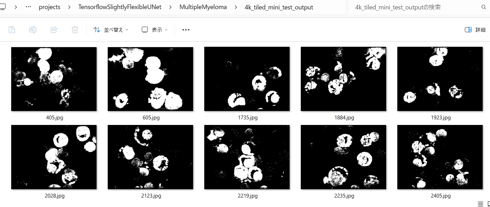
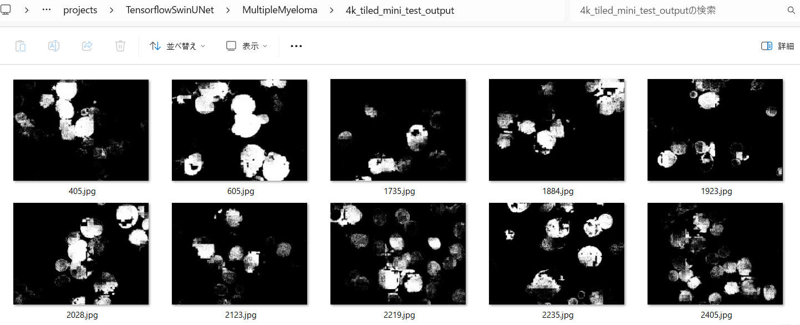
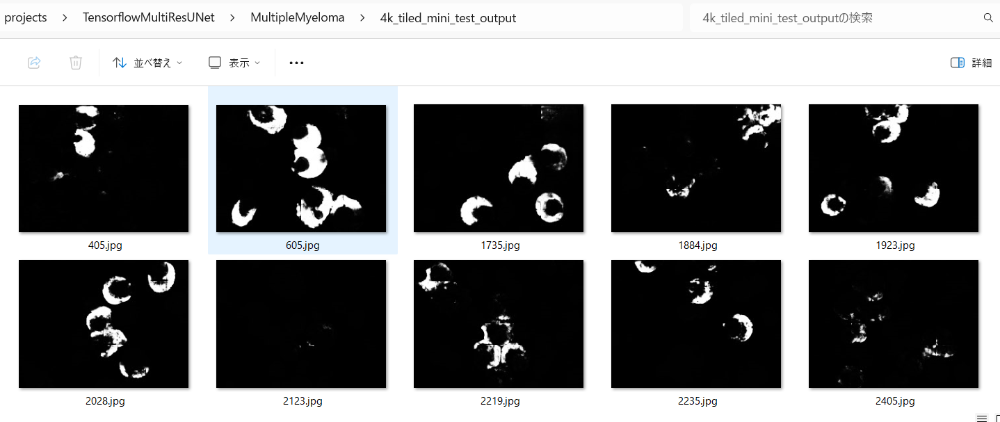

# Tensorflow-Image-Segmentation-API (Updated: 2024/03/06)
<h3>Contents</h3>
<li><a href="#1">1 Image Segmentation API </a></li>
<li><a href="#2">2 Dataset </a></li>
<li><a href="#3">3 TensorflowSlightlyFlexibleUNet</a></li>
<li><a href="#4">4 TensorflowSwinUNet</a></li>
<li><a href="#5">5 TensorflowMultiResUNet</a></li>
<li><a href="#6">6 TensorflowAttentionUNet</a></li>
<li><a href="#7">7 TensorflowUNet3Plust</a></li>
<!--
<li><a href="#8">8 TensorflowTransUNet</a></li>
 -->
<li><a href="#10">10 Image Segmentation Experimental projects</a></li>
<li><a href="#100">Dataset citations</a></li>
 
<li>2024/02/25: Fixed a git-clone error. </li>
<li>2024/03/02: Fixed a bug in infer_tiles method in TensorflowUNet.py.</li>
<li>2024/03/05: Modified TensorflowUNet.py to support bitwise_blending in infer_tiles method.</li>
See also <a href="./ChangeLog.md">ChangeLog.md (Updated: 2024/03/05)</a>
 
On bitwise_blending, please see <a href="https://github.com/sarah-antillia/Tensorflow-Tiled-Image-Segmentation-MultipleMyeloma">Tensorflow-Tiled-Image-Segmentation-MultipleMyeloma</a>.
 
 
<h2>
<a id="1">
1 Image Segmentation API 
</a>
</h2>
In this repository, we provide <b>Image Segmentation API</b> that supports the following <b>Tensorflow UNet Models</b>.
 
 
<li><a href="./projects/TensorflowSlightlyFlexibleUNet">TensorflowSlightlyFlexibleUNet</a></li>
<li><a href="./projects/TensorflowSwinUNet">TensorflowSwinUNet</a></li>
<li><a href="./projects/TensorflowMultiResUNet">TensorflowMultiResUNet</a></li>
<li><a href="./projects/TensorflowAttentionUNet">TensorflowAttentionUNet</a></li>
<li><a href="./projects/TensorflowEfficientUNet">TensorflowEfficientUNet</a></li>
<li><a href="./projects/TensorflowUNet3Plus">TensorflowUNet3Plus</a></li>
<!--
<li><a href="./projects/TensorflowTransUNet">TensorflowUNetTransUNet</a></li>
 -->

 
As a typical example of image segmentation in the medical science region, we have applied 
<b>Tiled-Image-Segmentation to 4K-images</b> of <a href="./dataset/MultipleMyeloma">MultipleMyeloma</a> dataset 
by using these Tensorflow UNet models.  
In some U-Net models, we had to use the <b>Overlapped-Tiled-Image-Segmentation</b> method, not 
the simple <b>Non-Overlapping-Tiling</b> method, to obtain a clear result comparable to that of our base U-Net model
<a href="./src/TensorflowUNet.py">TensorflowUNet</a>.  

We believe that this approach to 4K-Image is a promising step towards the real-world applications of Image-Segmentation technology.
  
This is not a competition, so we did not compare the accuracy of segmentation using those models. 
 
Based on our experiments on <b>Tiled-Image-Segmentation</b>, we think that the UNet model for 4K-Image should be: 
<li>Input image size >= 512x512. </li>
<li>BatchNormalization not needed. </li>
 
<b>4K Image Sample of MultipleMyeloma</b> taken from the following kaggle website 
<pre>
SegPC-2021: Segmentation of Multiple Myeloma Plasma Cells in Microscopic Images
https://www.kaggle.com/datasets/sbilab/segpc2021dataset
</pre>

<table>
<tr>
<td>
<b>Original 4K-Image</b> 

</td>
<td>
<b>Tiled-4K-Image-512x512</b> 
 
</td>
</tr>
</table>

 
<b> Tensorflow UNet Class Hierarchy </b> 
<a href="./src/TensorflowUNet.py">TensorflowUNet</a> 
  ├─ <a href="./src/TensorflowAttentionUNet.py">TensorflowAttentionUNet</a> 
  ├─ <a href="./src/TensorflowEfficientUNet.py">TensorflowEfficientUNet</a> 
  ├─ <a href="./src/TensorflowMultiResUNet.py">TensorflowMultiResUNet</a> 
  ├─ <a href="./src/TensorflowSwinUNet.py">TensorflowSwinUNet</a> 
  └─ <a href="./src/TensorflowUNet3Plus.py">TensorflowUNet3Plus</a> 
 
We appreciate all contributions of these UNet model. 

<a href="https://github.com/nikhilroxtomar/Semantic-Segmentation-Architecture/blob/main/TensorFlow/attention-unet.py">Attention-UNet</a> 
<a href="https://github.com/nikhilroxtomar/Semantic-Segmentation-Architecture/blob/main/TensorFlow/multiresunet.py">MultiResUNet</a> 
<a href="https://github.com/nikhilroxtomar/Semantic-Segmentation-Architecture/blob/main/TensorFlow/efficientnetb0_unet.py">EfficientNetUNet</a> 
<a href="https://github.com/yingkaisha/keras-unet-collection/blob/main/keras_unet_collection/_model_swin_unet_2d.py">SWinUNet2D</a> 
<a href="https://github.com/hamidriasat/UNet-3-Plus/blob/unet3p_lits/models/unet3plus_utils.py">UNet3Plus</a> 

   
<h2>
<a id="2">
2 Dataset
</a>
</h2>
<h3> 2.1 Data Collection</h3>
We have moved the dataset folder to a new repository <a href="https://github.com/sarah-antillia/Tensorflow-Image-Segmentation-Dataset">
Tensorflow-Image-Segmentation-Dataset</a>.
 
Please clone that repository to your dev-environment in order to use the dataset, which contains the following dataset. 

<li>ALL</li>
<li>BrainTumor</li>
<li>Brest-Cancer</li>
<li>CervicalCancer</li>
<li>GastrointestinalPolyp</li>
<li>Lung</li>
<li>Mammogram</li>
<li>MultipleMyeloma</li>
<li>Nerve</li>
<li>Ovarian-Tumor</li>
<li>Pap-Smear</li>
<li>Retinal-Vessel</li>
 

We appreciate all contributions of these dataset providers.<a href="#100">Dataset citations</a> 

The better the dataset, the better the result in Deep Learning, we guess. This is why we believe that "Data First" is the best principle for all in data science. 
 
These are augmented dataset generated by the off-line augmentation tools from the original dataset. 
Please note that these are archived in 7z format.  
 
 If you would like to train this MultipleMyeloma Segmentation model by yourself,
 please download new dataset from the google drive 
<a href="https://drive.google.com/file/d/1QiGah4_0yY-5B7s2kIZ2AjbEVu2ejB3G/view?usp=sharing">MultipleMyeloma-ImageMask-Dataset_V2_X.zip</a>
 
On that dataset, please see also <a href="https://github.com/sarah-antillia/MultipleMyeloma-ImageMask-Dataset">MultipleMyeloma-ImageMask-Dataset</a>
 
Please expand the downloaded ImageMaskDataset and place them under <b>./dataset</b> folder to be

<pre>
./dataset
└─MultipleMyeloma
    ├─test
    │  ├─images
    │  └─masks
    ├─train
    │  ├─images
    │  └─masks
    └─valid
        ├─images
        └─masks
</pre>
 
Please note that the pixel size of the new image/mask is 512x512, which is twice as large as that of the image/mask of 
the previous MultipleMyeloma Dataset in 
<a href="https://github.com/sarah-antillia/Tensorflow-Image-Segmentation-Dataset/tree/main/dataset/MultipleMyeloma">
Tensorflow-Image-Segmentation-Dataset</a>.

 
<b>MultipleMyelomaDataset Statistics</b> 
 
As shown above, the number of images of train and valid dataset is not necessarily large.
 
<h3>2.2 Dataset class (Updated:2023/11/01)</h3>
<b> Dataset Class Hierarchy </b> 
<a href="./src/BaseImageMaskDataset.py">BaseImageMaskDataet</a> 
  └─ <a href="./src/ImageMaskDataset.py">ImageMaskDataset</a> 

If your would like to use your own <b>SomethingImageMaskDataset</b> class,
, which shall inherits <b>BaseImageMaskDataet</b> class, in your model training or evaluation process, please specify your own dataset class name in dataset section of your train_eval_inf.config file as shown below. 
<pre>
[dataset]
;Specify a class name of your Image Mask Dataset
;datasetclass  = "BaseImageMaskDataset"
datasetclass  = "SomethingImageMaskDataset"

;Please specify a cv2.resize interpolation algorithm in case of ImageMaskDatast.
resize_interpolation = "cv2.INTER_CUBIC"
</pre>
 

 
<h3>2.3 Saved model (Updated:2023/11/01)</h3>

If your would like to save and load your trained model as a saved_model, please specify empty string for <b>save_model_file</b> in
[train] section in your <b>train_eval_infer.config</b> file. as shown below,  

<pre>
[train]
;2023/11/10
;save_model_file = "best_model.h5"

; To save your model as a saved_model by model.save(model_dir) method,
; please specify empty string for save_model_file as shown below, 
; because the save method never needs filename
save_model_file = ""

</pre>
 

<h3>2.4 4K-Mini-Test</h3>
To apply <b>Tiled-Image-Segmentation to 4K-images</b>, we have created the following 4K-Mini-Test MultipleMyeloma from the original dataset
 <b>
<a href="https://www.kaggle.com/datasets/sbilab/segpc2021dataset">SegPC-2021: Segmentation of Multiple Myeloma Plasma Cells in Microscopic Images</a></b>

MultipleMyeloma dataset. 

<table>
  <tr>
    <td></td>
    <td></td>
    <td></td>
    <td></td>
    <td></td>
  </tr>

  <tr>
    <td></td>
    <td></td>
    <td></td>
    <td></td>
    <td></td>

  </tr>
</table>
 

<h2>
<a id="3">
3 TensorflowSlightlyFlexibleUNet
</a>
</h2>
This <a href="./src/TensorflowUNet.py">TensorflowUNet</a> model can be slightly flexibly customizable by a configuration file. 
For example, <b>TensorflowSlightlyFlexibleUNet/MultipleMyeloma</b> model will be customizable
by using <a href="./projects/TensorflowSlightlyFlexibleUNet/MultipleMyeloma/train_eval_infer.config">
train_eval_infer.config.</a>
<h2>
3.1 Training
</h2>
Please move to a <b>./projects/TensorflowSlightlyFlexibleUNet/MultipleMyeloma</b> folder, 
and run the following bat file to train TensorflowUNet model for MultipleMyeloma. 
<pre>
./1.train.bat
</pre>

<h2>
3.2 Evaluation
</h2>
Please move to a <b>./projects/TensorflowSlightlyFlexibleUNet/MultipleMyeloma</b> folder, 
and run the following bat file to evalute TensorflowUNet model for MultipleMyeloma. 
<pre>
./2.evaluate.bat
</pre>

<h2>
3.3 Inference
</h2>
Please move to a <b>./projects/TensorflowSlightlyFlexibleUNet/MultipleMyeloma</b> folder 
,and run the following bat file to infer segmentation regions for images by the Trained-TensorflowUNet model for MultipleMyeloma. 
<pre>
./3.infer.bat
</pre>
<b>Image-Segmentation for 4K-Images:MultipleMyelom</b>

  

<h2>
3.4 Tiled-Image-Inference 
</h2>
Please move to a <b>./projects/TensorflowSlightlyFlexibleUNet/MultipleMyeloma</b> folder 
,and run the following bat file to do tile-image-inference segmentation for images by the Trained-TensorflowUNet model for MultipleMyeloma. 
<pre>
./4.tiled_infer.bat
</pre>
 
<b>Overlapped-Tiled-Image-Segmentation for 4K-Images:MultipleMyelom</b>

  

<h2>
<a id="4">
4 TensorflowSwinUNet
</a>
</h2>
This <a href="./src/TensorflowSwinUNet.py">TensorflowSwinUNet</a> model can be slightly flexibly customizable by a configuration file. 
For example, <b>TensorflowSwinUNet/MultipleMyeloma</b> model will be customizable
by using <a href="./projects/TensorflowSwinUNet/MultipleMyeloma/train_eval_infer.config">
train_eval_infer.config.</a>
<h2>
4.1 Training
</h2>
Please move to a <b>./projects/TensorflowSwinUNet/MultipleMyeloma</b> folder, 
and run the following bat file to train TensorflowSwinUNet model for MultipleMyeloma. 
<pre>
./1.train.bat
</pre>

<h2>
4.2 Evaluation
</h2>
Please move to a <b>./projects/TensorflowSwinUNet/MultipleMyeloma</b> folder, 
and run the following bat file to evalute TensorflowSwinUNet model for MultipleMyeloma. 
<pre>
./2.evaluate.bat
</pre>

<h2>
4.3 Inference
</h2>
Please move to a <b>./projects/TensorflowSwinUNet/MultipleMyeloma</b> folder 
,and run the following bat file to infer segmentation regions for images by the Trained-TensorflowSwinUNet model 
for MultipleMyeloma. 
<pre>
./3.infer.bat
</pre>
<b>Overlapped-Image-Segmentation for 4K-images: MultipleMyelom</b> 
 
 

<h2>
4.4 Tiled-Image-Inference 
</h2>
Please move to a <b>./projects/TensorflowSwinUNet/MultipleMyeloma</b> folder 
,and run the following bat file to do tile-image-inference segmentation for images by the Trained-TensorflowSwinUNet 
model for MultipleMyeloma. 
<pre>
./4.tiled_infer.bat
</pre>

<b>Overlapped-Tiled-Image-Segmentation for 4K-images: MultipleMyelom</b> 
 
 
On detail of Image Segmentation by TensorflowSwinUNet-MultipleMyeloma, please see also. 
<a href="https://github.com/sarah-antillia/TensorflowSwinUNet-Segmentation-MultipleMyeloma">
TensorflowSwinUNet-Segmentation-MultipleMyeloma</a>
 

<h2>
<a id="5">
5 TensorflowMultiResUNet
</a>
</h2>
This <a href="./src/TensorflowMultiResUNet.py">TensorflowMultiResUNet</a> model can be 
slightly flexibly customizable by a configuration file. 
For example, <b>TensorflowMultiResUNet/MultipleMyeloma</b> model will be customizable
by using <a href="./projects/TensorflowMultiResUNet/MultipleMyeloma/train_eval_infer.config">
train_eval_infer.config.</a>

<h2>
5.1 Training
</h2>
Please move to a <b>./projects/TensorflowMultiResUNet/MultipleMyeloma</b> folder, 
and run the following bat file to train TensorflowMultiResUNet model for MultipleMyeloma. 
<pre>
./1.train.bat
</pre>

<h2>
5.2 Evaluation
</h2>
Please move to a <b>./projects/TensorflowMultiResUNet/MultipleMyeloma</b> folder, 
and run the following bat file to evalute TensorflowSwinUNet model for MultipleMyeloma. 
<pre>
./2.evaluate.bat
</pre>

<h2>
5.3 Inference
</h2>
Please move to a <b>./projects/TensorflowMultiResUNet/MultipleMyeloma</b> folder 
,and run the following bat file to infer segmentation regions for images by the Trained-TensorflowMultiResUNet model for MultipleMyeloma. 
<pre>
./3.infer.bat
</pre>
<b>Image-Segmentation for 4K-Images: MultipleMyelom</b> 

 
<h2>
5.4 Tiled-Image-Inference 
</h2>
Please move to a <b>./projects/TensorflowMultiResUNet/MultipleMyeloma</b> folder 
,and run the following bat file to do tile-image-inference segmentation for images by the Trained-TensorflowMultiResUNet model for MultipleMyeloma. 
<pre>
./4.tiled_infer.bat
</pre>

<b>Overlapped-Tiled-Image-Segmentation for 4K-Images:MultipleMyelom</b> 
 
 
On detail of Image Segmentation by TensorflowMultiResUNet-MultipleMyeloma, please see also. 
<a href="https://github.com/sarah-antillia/TensorflowMultiResUNet-Segmentation-MultipleMyeloma">
TensorflowMultiResUNet-Segmentation-MultipleMyeloma</a>
 

<h2>
<a id="6">
6 TensorflowAttentionUNet
</a>
</h2>
This <a href="./src/TensorflowAttentionUNet.py">TensorflowAttentionUNet</a> model can be 
slightly flexibly customizable by a configuration file. 
For example, <b>TensorflowAttentionUNet/MultipleMyeloma</b> model will be customizable
by using <a href="./projects/TensorflowAttentionUNet/MultipleMyeloma/train_eval_infer.config">
train_eval_infer.config.</a>

<h2>
6.1 Training
</h2>
For example, please move to a <b>./projects/TensorflowAttentionUNet/MultipleMyeloma</b> folder, 
and run the following bat file to train TensorflowAttentionUNet model for MultipleMyeloma. 
<pre>
./1.train.bat
</pre>

<h2>
6.2 Evaluation
</h2>
Please move to a <b>./projects/TensorflowAttentionUNet/MultipleMyeloma</b> folder, 
and run the following bat file to evalute TensorflowAttentionUNet model for MultipleMyeloma. 
<pre>
./2.evaluate.bat
</pre>

<h2>
6.3 Inference
</h2>
Please move to a <b>./projects/TensorflowAttentionUNet/MultipleMyeloma</b> folder 
,and run the following bat file to infer segmentation regions for images by the Trained-TensorflowAttentionUNet model for MultipleMyeloma. 
<pre>
./3.infer.bat
</pre>
<b>Image-Segmentation for 4K-Images: MultipleMyelom</b> 

 
<h2>
6.4 Tiled-Image-Inference 
</h2>
Please move to a <b>./projects/TensorflowAttentionUNet/MultipleMyeloma</b> folder 
,and run the following bat file to do tile-image-inference segmentation for images by the Trained-TensorflowAttentionUNet model for MultipleMyeloma. 
<pre>
./4.tiled_infer.bat
</pre>

<b>Overlapped-Tiled-Image-Segmentation for 4K-Images: MultipleMyelom</b> 

 

On detail of Image Segmentation by TensorflowAttentionUNet, please see also. 
<a href="https://github.com/atlan-antillia/Tensorflow-Slightly-Flexible-Attention-UNet">Tensorflow-Slightly-Flexible-Attention-UNet</a>
 

<h2>
<a id="7">
7 TensorflowUNet3Plus
</a>
</h2>
This <a href="./src/TensorflowUNet3Plus.py">TensorflowUNet3Plus</a> model can be 
slightly flexibly customizable by a configuration file. 
For example, <b>TTensorflowUNet3Plus/MultipleMyeloma</b> model will be customizable
by using <a href="./projects/TensorflowUNet3Plus/MultipleMyeloma/train_eval_infer.config">
train_eval_infer.config.</a>

7.1 Training
</h2>
Please move to a <b>./projects/TensorflowUNet3Plus/MultipleMyeloma</b> folder, 
and run the following bat file to train TensorflowUNet3Plus model for MultipleMyeloma. 
<pre>
./1.train.bat
</pre>

<h2>
7.2 Evaluation
</h2>
Please move to a <b>./projects/TensorflowUNet3Plus/MultipleMyeloma</b> folder, 
and run the following bat file to evalute TensorflowUNet3Plus model for MultipleMyeloma. 
<pre>
./2.evaluate.bat
</pre>

<h2>
7.3 Inference
</h2>
Please move to a <b>./projects/TensorflowUNet3Plus/MultipleMyeloma</b> folder 
,and run the following bat file to infer segmentation regions for images by the Trained-TensorflowUNet3Plus model for MultipleMyeloma. 
<pre>
./3.infer.bat
</pre>
b>Image-Segmentation for 4K-Images: MultipleMyelom</b> 

 
 
<h2>
7.4 Tiled-Image-Inference 
</h2>
Please move to a <b>./projects/TensorflowUNet3Plus/MultipleMyeloma</b> folder 
,and run the following bat file to do tile-image-inference segmentation for images by the Trained-TensorflowUNet3Plus model for MultipleMyeloma. 
<pre>
./4.tiled_infer.bat
</pre>

 
<b>Overlapped-Tiled-Image-Segmentation for 4K-Images: MultipleMyelom</b> 

 
On detail of Image Segmentation by TensorflowUNet3Plus, please see also. 
<a href="https://github.com/sarah-antillia/TensorflowUNet3Plus-Segmentation-MultipleMyeloma">TensorflowUNet3Plus-Segmentation-MultipleMyeloma</a>
 

<!--
 -->
<!--
<h2>
<a id="8">
8 TensorflowTransUNet
</a>
</h2>
This <a href="./src/TensorflowTransUNet.py">TensorflowTransUNet</a> model can be 
slightly flexibly customizable by a configuration file. 
For example, <b>TensorflowTransUNet/MultipleMyeloma</b> model will be customizable
by using <a href="./projects/TensorflowTransUNet/MultipleMyeloma/train_eval_infer.config">
train_eval_infer.config.</a>

<h2>
8.1 Training
</h2>
Please move to a <b>./projects/TensorflowTransUNet/MultipleMyeloma</b> folder, 
and run the following bat file to train TensorflowTransUNet model for MultipleMyeloma. 
<pre>
./1.train.bat
</pre>

<h2>
8.2 Evaluation
</h2>
Please move to a <b>./projects/TensorflowTransUNet/MultipleMyeloma</b> folder, 
and run the following bat file to evalute TensorflowTransUNet model for MultipleMyeloma. 
<pre>
./2.evaluate.bat
</pre>

<h2>
8.3 Inference
</h2>
Please move to a <b>./projects/TensorflowTransUNet/MultipleMyeloma</b> folder 
,and run the following bat file to infer segmentation regions for images by the Trained-TensorflowTransUNet model for MultipleMyeloma. 
<pre>
./3.infer.bat
</pre>

<h2>
8.4 Tiled-Image-Inference 
</h2>
Please move to a <b>./projects/TensorflowTransUNet/MultipleMyeloma</b> folder 
,and run the following bat file to do tile-image-inference segmentation for images by the Trained-TensorflowTransUNet model for MultipleMyeloma. 
<pre>
./4.tiled_infer.bat
</pre>

 
<b>Overlapped-Tiled-Image-Segmentation for 4K-Images: MultipleMyelom</b> 

 
 
-->

<h2>
<a id="10">10 Image Segmentation Experimental projects</a>
</h2>
We have a lot of experimetal Image-Segmentation projects based on this Tensorflow Image Segmentation API.
 
<h3>
10.1 TensorflowSlightlyFlexibleUNet
</h3>
<h3>
<a href="https://github.com/atlan-antillia/Image-Segmentation-Acute-Lymphoblastic-Leukemia">
Image-Segmentation-Acute-Lymphoblastic-Leukemia
</a>
</h3>
 

 
 
 
<h3>
<a href="https://github.com/atlan-antillia/Image-Segmentation-Brain-Tumor">
Image-Segmentation-Brain-Tumor
</a>
</h3>
 

 
 
 

<h3>
<a href="https://github.com/atlan-antillia/Image-Segmentation-Gastrointestinal-Polyp">
Image-Segmentation-Gastrointestinal-Polyp
</a>
</h3>
 

 
 
 

<h3>
<a href="https://github.com/atlan-antillia/Tiled-Image-Segmentation-Multiple-Myeloma">
Tiled-Image-Segmentation-Multiple-Myeloma
</a>
</h3>
 

 
 
 

<h3>
<a href="https://github.com/atlan-antillia/Image-Segmentation-Cervical-Cancer">
Image-Segmentation-Cervical-Cancer
</a>
</h3>
 

 
 
 

<h3>
<a href="https://github.com/atlan-antillia/Image-Segmentation-Multiple-Myeloma">
Image-Segmentation-Multiple-Myeloma
</a>
</h3>
 

 
 
 
<h3>
<a href="https://github.com/atlan-antillia/Image-Segmentation-Breast-Cancer">
Image-Segmentation-Breast-Cancer
</a>
</h3>
 

 
 
 

<h3>
<a href="https://github.com/sarah-antillia/Image-Segmentation-ImageMaskDataGenerator">
Image-Segmentation-ImageMaskDataGenerator
</a>
</h3>
 

 
 
 
<h3>
<a href="https://github.com/sarah-antillia/Image-Segmentation-Neuroblastoma">
Image-Segmentation-Neuroblastoma
</a>
</h3>
 

 
 
 

<h3>
<a href="https://github.com/sarah-antillia/Image-Segmentation-Blood-Cell">
Image-Segmentation-Blood-Cell
</a>
</h3>
 

 
 
 
<h3>
<a href="https://github.com/sarah-antillia/Image-Segmentation-Kidney-Tumor">
Image-Segmentation-Kidney-Tumor
</a>
</h3>
 

 
 
 

<h3>
<a href="https://github.com/sarah-antillia/Image-Segmentation-Liver-Tumor">
Image-Segmentation-Liver-Tumor
</a>
</h3>
 

 
 
 
<h3>
<a href="https://github.com/sarah-antillia/Image-Segmentation-Neoplastic-Cell">
Image-Segmentation-Neoplastic-Cell
</a>
</h3>
 

 
 
 
<h3>
<a href="https://github.com/sarah-antillia/Image-Segmentation-CDD-CESM-Mammogram">
Image-Segmentation-CDD-CESM-Mammogram
</a>
</h3>
 

 
 
 
<h3>
<a href="https://github.com/sarah-antillia/Image-Segmentation-Retinal-Vessel">
Image-Segmentation-Retinal-Vessel
</a>
</h3>
 

 
 
 
<b>ImageMaskDataGenerator</b> 
<h3>
<a href="https://github.com/sarah-antillia/Image-Segmentation-ImageMaskDataGenerator">
Image-Segmentation-ImageMaskDataGenerator
</a>
</h3>
 

 
 
 

<!--
 Attention UNet
-->
<h3>
10.2 TensorflowSlightlyFlexibleAttentionUNet
</h3>
<h3>
<a href="https://github.com/atlan-antillia/Tensorflow-Slightly-Flexible-Attention-UNet">
Tensorflow-Slightly-Flexible-Attention-UNet
</a>
</h3>
 

 
 
 

<!--
  MultiRes
 -->
<h3>
10.3 TensorflowMultiResUNet
</h3>
<h3>
<a href="https://github.com/sarah-antillia/TensorflowMultiResUNet-Segmentation-Gastrointestinal-Polyp">
TensorflowMultiResUNet-Segmentation-Gastrointestinal-Polyp
</a>
</h3>
 

 
 
 
<h3>
<a href="https://github.com/sarah-antillia/TensorflowMultiResUNet-Segmentation-MultipleMyeloma">
TensorflowMultiResUNet-Segmentation-MultipleMyeloma
</a>
</h3>
 

 
 
 

<!--
 SWinUNet  
 -->
<h3>
10.4 TensorflowSwinUNet
</h3>
<h3>
<a href="https://github.com/sarah-antillia/TensorflowSwinUNet-Segmentation-CDD-CESM-Mammogram">
TensorflowSwinUNet-Segmentation-CDD-CESM-Mammogram
</a>
</h3>
 

 
 
 
<h3>
<a href="https://github.com/sarah-antillia/TensorflowSwinUNet-Segmentation-Gastrointestinal-Polyp">
TensorflowSwinUNet-Segmentation-Gastrointestinal-Polyp
</a>
</h3>
 

 
 
 
<h3>
<a href="https://github.com/sarah-antillia/TensorflowSwinUNet-Segmentation-MultipleMyeloma">
TensorflowSwinUNet-Segmentation-MultipleMyeloma
</a>
</h3>
 

 
 
 
<h3>
<a href="https://github.com/sarah-antillia/TensorflowSwinUNet-Segmentation-Skin-Lesion">
TensorflowSwinUNet-Segmentation-Skin-Lesion
</a>
</h3>
 

 
 
 

<!--
 UNet3Plus  
 -->
<h3>
10.5 TensorflowUNet3Plus
</h3>
<h3>
<a href="https://github.com/sarah-antillia/TensorflowUNet3Plus-Segmentation-Gastrointestinal-Polyp">
TensorflowUNet3Plus-Segmentation-Gastrointestinal-Polyp
</a>
</h3>
 

 
 
 
<h3>
<a href="https://github.com/sarah-antillia/TensorflowUNet3Plus-Segmentation-MultipleMyeloma">
TensorflowUNet3Plus-Segmentation-MultipleMyeloma
</a>
</h3>

 
 
<!--
 TensorflowEffientUNet
-->
<h3>
10.6 TensorflowEfficientUNet
</h3>
<h3>
<a href="https://github.com/sarah-antillia/TensorflowEfficientUNet-Segmentation-CDD-CESM-Mammogram">
TensorflowEfficientUNet-Segmentation-CDD-CESM-Mammogram
</a>
</h3>
 

 
 
 

 
<h2>
<a id="100">
Dataset citations
</a>
</h2>
<h3></h3>

<b>1. <a href="./dataset/ALL">ALL</a></b> 
<pre>
Acute Lymphoblastic Leukemia (ALL) image dataset
https://www.kaggle.com/datasets/mehradaria/leukemia
</pre>
<pre>
If you use this dataset in your research, please credit the authors.
Data Citation:
Mehrad Aria, Mustafa Ghaderzadeh, Davood Bashash, Hassan Abolghasemi, Farkhondeh Asadi, 
and Azamossadat Hosseini, “Acute Lymphoblastic Leukemia (ALL) image dataset.” Kaggle, 
(2021). DOI: 10.34740/KAGGLE/DSV/2175623.

Publication Citation:
Ghaderzadeh, M, Aria, M, Hosseini, A, Asadi, F, Bashash, D, Abolghasemi, 
H. A fast and efficient CNN model for B-ALL diagnosis and its subtypes 
classification using peripheral blood smear images. Int J Intell Syst. 2022; 37: 5113- 5133. doi:10.1002/int.22753
</pre>

<b>2. <a href="./dataset/BrainTumor">BrainTumor</a></b> 
<pre>
Brain MRI segmentation
https://www.kaggle.com/datasets/mateuszbuda/lgg-mri-segmentation
</pre>
<pre>
LGG Segmentation Dataset 
Dataset used in: 

Mateusz Buda, AshirbaniSaha, Maciej A. Mazurowski "Association of genomic subtypes of 
lower-grade gliomas with shape features automatically extracted by a deep learning 
algorithm." Computers in Biology and Medicine, 2019.
and
Maciej A. Mazurowski, Kal Clark, Nicholas M. Czarnek, Parisa Shamsesfandabadi, 
Katherine B. Peters, Ashirbani Saha "Radiogenomics of lower-grade glioma: 
algorithmically-assessed tumor shape is associated with tumor genomic subtypes 
and patient outcomes in a multi-institutional study with 
The Cancer Genome Atlas data." Journal of Neuro-Oncology, 2017.

This dataset contains brain MR images together with manual FLAIR abnormality 
segmentation masks.
The images were obtained from The Cancer Imaging Archive (TCIA).
They correspond to 110 patients included in The Cancer Genome Atlas (TCGA) 
lower-grade glioma collection with at least fluid-attenuated inversion recovery (FLAIR) 
sequence and genomic cluster data available.
Tumor genomic clusters and patient data is provided in data.csv file.
</pre>

<b>3. <a href="./dataset/CervicalCancer">CervicalCancer</a></b> 
<pre>
Cervical Cancer largest dataset (SipakMed)
https://www.kaggle.com/datasets/prahladmehandiratta/cervical-cancer-largest-dataset-sipakmed
</pre>
<b>About Dataset</b> 
<pre>
Please don't forget to upvote if you find this useful.
Context
Cervical cancer is the fourth most common cancer among women in the world, estimated more than 0.53 million 
women are diagnosed in every year but more than 0.28 million women’s lives are taken by cervical cancer 
in every years . Detection of the cervical cancer cell has played a very important role in clinical practice.

Content
The SIPaKMeD Database consists of 4049 images of isolated cells that have been manually cropped from 966 cluster
 cell images of Pap smear slides. These images were acquired through a CCD camera adapted to an optical microscope. 
 The cell images are divided into five categories containing normal, abnormal and benign cells.

Acknowledgements
IEEE International Conference on Image Processing (ICIP) 2018, Athens, Greece, 7-10 October 2018.

Inspiration
CERVICAL Cancer is an increasing health problem and an important cause of mortality in women worldwide. 
Cervical cancer is a cancer is grow in the tissue of the cervix . It is due to the abnormal growth of cell that 
are spread to the other part of the body.
Automatic detection technique are used for cervical abnormality to detect Precancerous cell or cancerous cell 
than no pathologist are required for manually detection process.
</pre>

<b>4. <a href="./dataset/GastrointestinalPolyp">GastrointestinalPolyp</a></b> 
<pre>
Kvasir-SEG Data (Polyp segmentation & detection)
https://www.kaggle.com/datasets/debeshjha1/kvasirseg
</pre>

<b>5. <a href="./dataset/Mammogram">Mammogram</a></b> 
<pre>
http://www.eng.usf.edu/cvprg/mammography/database.html
</pre>
<pre>
# Digital Database for Screening Mammography segmentation annotation data
The images files in this directory are 66 Digital Database for Screening Mammography (DDSM) 
mammograms and the corresponding manual annotations of mammograms which show
the fibroglandular, adipose, and pectoral muscle tissue regions. To our knowledge, the dataset 
is the first publicly available breast tissue segmentation masks for screen film mammography 
in the world. The permission for the use of DDSM data is explained in our paper.
The dataset includes manual annotations for 16 Type A, 20 Type B, 17 Type C, and 13 Type D mammograms. 
Manual annotation file names are the original mammogram file name
concatenated with “_LI”, which stands for “labelled image”. Mammograms and the manual annotations have
a resolution of 960x480. 64, 128, 192, and 255 intensity pixels in the manual annotations show background, 
adipose tissue, fibroglandular tissue, and pectoral muscle
tissue regions, respectively. The images are grayscale. Mammograms and manual annotations  are located 
under "fgt_seg" and "fgt_seg_labels" subdirectories of
"train_valid" and "test" directories. These are the training, validation, and test mammograms that were 
used for modelling the mammogram segmentation in our article. We
have given the names of the cross-validation file names in the supplementary materials document. 
You may find the methods about preprocessing of mammograms and manual
annotations in our journal article.
</pre>

<b>6. <a href="./dataset/MultipleMyeloma">MultipleMyeloma</a></b> 
<pre>
SegPC-2021: Segmentation of Multiple Myeloma Plasma Cells in Microscopic Images
https://www.kaggle.com/datasets/sbilab/segpc2021dataset
</pre>
Citation: 
<pre>
Anubha Gupta, Ritu Gupta, Shiv Gehlot, Shubham Goswami, April 29, 2021, "SegPC-2021: Segmentation of Multiple Myeloma Plasma Cells 
in Microscopic Images", IEEE Dataport, doi: https://dx.doi.org/10.21227/7np1-2q42.
BibTex
@data{segpc2021,
doi = {10.21227/7np1-2q42},
url = {https://dx.doi.org/10.21227/7np1-2q42},
author = {Anubha Gupta; Ritu Gupta; Shiv Gehlot; Shubham Goswami },
publisher = {IEEE Dataport},
title = {SegPC-2021: Segmentation of Multiple Myeloma Plasma Cells in Microscopic Images},
year = {2021} }
IMPORTANT:
If you use this dataset, please cite below publications-
1. Anubha Gupta, Rahul Duggal, Shiv Gehlot, Ritu Gupta, Anvit Mangal, Lalit Kumar, Nisarg Thakkar, and Devprakash Satpathy, 
 "GCTI-SN: Geometry-Inspired Chemical and Tissue Invariant Stain Normalization of Microscopic Medical Images," 
 Medical Image Analysis, vol. 65, Oct 2020. DOI: 
 (2020 IF: 11.148)
2. Shiv Gehlot, Anubha Gupta and Ritu Gupta, 
 "EDNFC-Net: Convolutional Neural Network with Nested Feature Concatenation for Nuclei-Instance Segmentation,"
 ICASSP 2020 - 2020 IEEE International Conference on Acoustics, Speech and Signal Processing (ICASSP), 
 Barcelona, Spain, 2020, pp. 1389-1393.
3. Anubha Gupta, Pramit Mallick, Ojaswa Sharma, Ritu Gupta, and Rahul Duggal, 
 "PCSeg: Color model driven probabilistic multiphase level set based tool for plasma cell segmentation in multiple myeloma," 
 PLoS ONE 13(12): e0207908, Dec 2018. DOI: 10.1371/journal.pone.0207908
License
CC BY-NC-SA 4.0
</pre>

<b>7. <a href="./dataset/Nerve">Nerve</a></b> 
<pre>
 Ultrasound Nerve Segmentation 
 Identify nerve structures in ultrasound images of the neck 
</pre>

<pre>
Dataset Description
The task in this competition is to segment a collection of nerves called the Brachial Plexus (BP) in ultrasound images. 
You are provided with a large training set of images where the nerve has been manually annotated by humans. 
Annotators were trained by experts and instructed to annotate images where they felt confident about the existence of 
the BP landmark.

Please note these important points:

The dataset contains images where the BP is not present. Your algorithm should predict no pixel values in these cases.
As with all human-labeled data, you should expect to find noise, artifacts, and potential mistakes in the ground truth. 
Any individual mistakes (not affecting the broader integrity of the competition) will be left as is.
Due to the way the acquisition machine generates image frames, you may find identical images or very similar images.
In order to reduce the submission file sizes, this competition uses run-length encoding (RLE) on the pixel values. 
The details of how to use RLE are described on the 'Evaluation' page.
File descriptions
/train/ contains the training set images, named according to subject_imageNum.tif. Every image with the same subject 
number comes from the same person. This folder also includes binary mask images showing the BP segmentations.
/test/ contains the test set images, named according to imageNum.tif. You must predict the BP segmentation for these 
images and are not provided a subject number. There is no overlap between the subjects in the training and test sets.
train_masks.csv gives the training image masks in run-length encoded format. This is provided as a convenience to 
demonstrate how to turn image masks into encoded text values for submission.
sample_submission.csv shows the correct submission file format.
</pre>

<b>8. <a href="./dataset/Retinal-Vessel">Retinal-Vessel</a></b> 
<pre>
Retinal Image Analysis
</pre>
<pre>
https://blogs.kingston.ac.uk/retinal/chasedb1/
</pre>

<b>9. <a href="./dataset/Pap-Smearl">Pap-Smear</a></b> 
<b>PAP-SMEAR (DTU/HERLEV) DATABASES & RELATED STUDIES</b> 
<pre>
https://mde-lab.aegean.gr/index.php/downloads/
Part II : smear2005.zip [85.17 MB] New Pap-smear Database (images)
This is the new website that hosts the DTU/Herlev Pap Smear Databases, as well as selected studies and papers 
related to these data. For more than 10 years, Dr Jan Jantzen works on pap-smear data acquired from images of 
healthy & cancerous smears coming from the Herlev University Hospital (Denmark), thanks to Dr MD Beth Bjerregaard.
The Old Pap Smear Database was formed in the late 90’s while the New Pap Smear Database (improved) was formed 
within 2005. The analysis of these databases was made through several Master Theses most of which where elaborated 
in Denmark, under the supervision of Dr Jantzen, while he was joining DTU, Dept. of Automation (Denmark) and also 
through collaboration to other researchers from around the world, many of which were made with G.Dounias and his
research team of the MDE-Lab, University of the Aegean. During the last years, Dr Jantzen collaborates with the 
University of the Aegean, Dept. of Financial and Management Engineering (FME) as teaching associate of the 
Postgraduate Program of the FME-Dept. and as research associate of the MDE-Lab. The site will be continuously 
updated with new papers, studies, theses and citations related to the hosted pap-smear databases.
</pre>

<b>10. <a href="./dataset/Ovarina-Tumor">Ovarian-Tumor</a></b> 
The original image dataset OTU_2d used here has been taken from the following google drive. 
<a href="https://drive.google.com/drive/folders/1c5n0fVKrM9-SZE1kacTXPt1pt844iAs1">MMOTU</a> 

<pre>
MMOTU_DS2Net
https://github.com/cv516Buaa/MMOTU_DS2Net
Dataset
Multi-Modality Ovarian Tumor Ultrasound (MMOTU) image dataset consists of two sub-sets with two modalities, 
which are OTU_2d and OTU_CEUS respectively including 1469 2d ultrasound images and 170 CEUS images. 
On both of these two sub-sets, we provide pixel-wise semantic annotations and global-wise category annotations. 
Many thanks to Department of Gynecology and Obstetrics, Beijing Shijitan Hospital, 
Capital Medical University and their excellent works on collecting and annotating the data.
</pre>

<b>11. <a href="./dataset/Lung">Lung</a></b> 
<pre>
Chest Xray Masks and Labels
https://www.kaggle.com/datasets/nikhilpandey360/chest-xray-masks-and-labels
</pre>
<pre>
The dataset contains x-rays and corresponding masks. Some masks are missing so it is advised 
to cross-reference the images and masks.
Original Dataset before modification
The OP had the following request:
It is requested that publications resulting from the use of this data attribute the source 
(National Library of Medicine, National 
Institutes of Health, Bethesda, MD, USA and Shenzhen No.3 People窶冱 Hospital, Guangdong Medical
 College, Shenzhen, China) and cite 
the following publications:
Jaeger S, Karargyris A, Candemir S, Folio L, Siegelman J, Callaghan F, Xue Z, Palaniappan K, 
Singh RK, Antani S, Thoma G, Wang YX, 
Lu PX, McDonald CJ. Automatic tuberculosis screening using chest radiographs. 
IEEE Trans Med Imaging. 2014 Feb;33(2):233-45. doi: 10.1109/TMI.2013.2284099. PMID: 24108713
Candemir S, Jaeger S, Palaniappan K, Musco JP, Singh RK, Xue Z, Karargyris A, Antani S, Thoma G, McDonald CJ. 
Lung segmentation in chest radiographs using anatomical atlases with nonrigid registration. 
IEEE Trans Med Imaging. 2014 Feb;33(2):577-90. doi: 10.1109/TMI.2013.2290491. PMID: 24239990
Montgomery County X-ray Set
X-ray images in this data set have been acquired from the tuberculosis control program of the 
Department of Health and Human Services 
of Montgomery County, MD, USA. This set contains 138 posterior-anterior x-rays, of which 80 
x-rays are normal and 58 x-rays are abnormal
 with manifestations of tuberculosis. All images are de-identified and available in DICOM format. 
The set covers a wide range of 
 abnormalities, including effusions and miliary patterns. The data set includes radiology 
readings available as a text file.
Ideas
Experiment with lung segmentation
Build disease classifiers for various conditions
Test models on data across different manufacturers
Build GANs that are able to make the datasets indistinguishable 
(Adversarial Discriminative Domain Adaptation: https://arxiv.org/abs/1702.05464)
</pre>
<b>License</b> 
CC0: Public Domain
 
